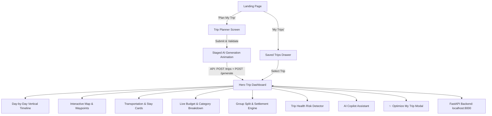

# TRIPNEX 🚀
> **AI-Powered Group Travel Copilot for Student Getaways**

[](https://fastapi.tiangolo.com)
[](https://react.dev)
[](https://vitejs.dev)
[](https://www.sqlite.org)

---

## 🧭 Overview

**TRIPNEX** solves the hackathon challenge:
> *"Group Trip Itinerary Planner — Build a tool where a group adds destinations, dates, and budget, and the app auto-arranges a day-wise itinerary with per-person cost split."*

### Expanded Product Vision: **PLAN → TRAVEL → SPEND → ADAPT**

- **PLAN**: Multi-leg transit, verified student homestays/hostels, and curated day-wise activities.
- **TRAVEL**: Synchronized group timeline, real-time waypoints, and weather forecast indicators.
- **SPEND**: Live budget utilization gauge, category breakdowns, and zero-math member debt settlement.
- **ADAPT**: **Killer Feature** — Real-time AI re-planning when budgets change, people drop out, or delays occur midway.

---

## 🌟 Key Features

1. **🎨 Premium Modern UI/UX**:
   - Deep Navy (`#071A3D`), Electric Blue (`#1677FF`), Sky Blue (`#38BDF8`), and Light Slate (`#F5F8FC`) design system.
   - Glassmorphism, smooth animations, and responsive layouts across desktop and mobile.

2. **🪄 Staged Generation Animation**:
   - Sequential 1.8s checklist (Understanding group → Optimizing budget → Planning transportation → Finding activities → Itinerary ready).

3. **📅 Day-by-Day Vertical Itinerary**:
   - Time slots (e.g. 7:00 AM, 7:20 AM, 10:45 AM, 11:15 AM, 1:00 PM, 2:30 PM, etc.).
   - Multi-leg transit modes (walk, bus, auto rickshaw, rented scooters).
   - Per-person and total cost breakdown with student tips.

4. **💰 Live Budget & Group Expense Engine**:
   - Tracks total vs spent vs remaining budget.
   - 5-member student balance cards (*You*, *Rahul*, *Ananya*, *Priya*, *Arjun*).
   - 1-Click settlement suggestions (*"Rahul should receive ₹380 from Ananya"*).

5. **✨ Killer Feature — "Optimize My Trip"**:
   - Situational adaptations (*Budget decreased*, *We're running late*, *Someone dropped out*, *More activities*, *Relaxed pace*).
   - Real-time Before vs After comparison and instant dashboard delta recalculation.

6. **🤖 Floating AI Trip Copilot**:
   - Instant group travel advice, quick prompts, and contextual re-balancing.

7. **🛡️ Trip Health & Risk Detector**:
   - Proactive conflict monitoring with 1-click automatic resolution.

---

## 🛠️ Architecture



---

## 🚀 Getting Started

### Prerequisites
- **Python 3.10+**
- **Node.js 18+** & **npm**

---

### 1. Start the FastAPI Backend

```powershell
cd backend
# Using the existing virtual environment
.\venv\Scripts\python.exe -m uvicorn main:app --reload --host 127.0.0.1 --port 8000
```
- Backend API Docs: [http://127.0.0.1:8000/docs](http://127.0.0.1:8000/docs)
- Health Endpoint: [http://127.0.0.1:8000/health](http://127.0.0.1:8000/health)

---

### 2. Start the Frontend App

```powershell
cd frontend
npm install
npm run dev
```
- Open [http://localhost:5173](http://localhost:5173) in your browser.

---

## 📂 Project Structure

```
tripnex_project/
├── backend/
│   ├── main.py            # FastAPI entrypoint & CORS
│   ├── database.py        # SQLite SQLAlchemy engine
│   ├── models.py          # Trip database model
│   ├── schemas.py         # Pydantic schemas (TripCreate, TripResponse)
│   ├── tripnex.db         # SQLite persistent database
│   └── venv/              # Python virtual environment
├── frontend/
│   ├── index.html         # SEO meta tags & Google fonts
│   ├── package.json       # Dependencies (React, Vite, lucide-react)
│   └── src/
│       ├── api/
│       │   └── trips.js             # FastAPI API client & offline fallback
│       ├── components/
│       │   ├── Navbar.jsx           # Brand header, status pill & nav
│       │   ├── LandingHero.jsx      # Hero with presets & 4-step promise
│       │   ├── HowItWorksModal.jsx  # Process explainer modal
│       │   ├── SavedTripsDrawer.jsx # History drawer (GET /trips)
│       │   ├── TripPlanner.jsx      # Validated generator form
│       │   ├── GeneratingScreen.jsx # Staged 1.8s animated checklist
│       │   ├── TripHeader.jsx       # Dashboard hero banner & actions
│       │   ├── DayTabs.jsx          # Day 1/2/3 tab switcher
│       │   ├── Timeline.jsx         # Vertical timeline with timestamps
│       │   ├── TransportCard.jsx    # Multi-leg transit cards
│       │   ├── HotelCard.jsx        # Stay details, check-in/out & pricing
│       │   ├── ActivityCard.jsx     # Curated activity recommendations
│       │   ├── BudgetPanel.jsx      # Live gauges & category breakdown
│       │   ├── GroupSplit.jsx       # Member balances & debt settlements
│       │   ├── TripHealth.jsx       # Risk detector & automatic fixers
│       │   ├── InteractiveMap.jsx   # GPS waypoint simulation
│       │   ├── Copilot.jsx          # Floating AI Assistant
│       │   └── OptimizeModal.jsx    # Killer Feature: Adaptive Re-planner
│       ├── data/
│       │   ├── demoTrip.js          # Default rich Pondicherry dataset
│       │   └── tripEnricher.js      # Dynamic enrichment & calculation engine
│       ├── pages/
│       │   ├── Home.jsx             # Landing page
│       │   ├── Planner.jsx          # Trip planner page
│       │   └── TripDashboard.jsx    # Hero dashboard page
│       ├── index.css                # TRIPNEX design system & tokens
│       ├── App.jsx                  # Main application orchestrator
│       └── main.jsx                 # Vite React entrypoint
└── README.md
```

---

## 🏆 Hackathon Demo Tips

1. **Preset Showcase**: On the landing page, click any of the 3 instant presets (*Pondicherry*, *Goa*, *Manali*) to immediately demonstrate generation and dashboard rendering to judges.
2. **Killer Feature ("✨ Optimize Trip")**: On the dashboard, click **"✨ Optimize Trip"** → select **"Budget decreased"** to demonstrate live Before/After comparison and instant savings recalculation.
3. **Settlement Demonstration**: In the **Group Expense Engine**, click any settlement suggestion (e.g. *"Rahul should receive ₹380 from Ananya"*) to mark it settled in real-time.
4. **Trip Health Autofix**: In the **Trip Health** section, click **"Fix automatically"** on the checkout conflict to observe the AI automatically resolve hotel luggage hold.

---

© 2026 TRIPNEX. Built with ❤️ for Student Group Travel Hackathon.